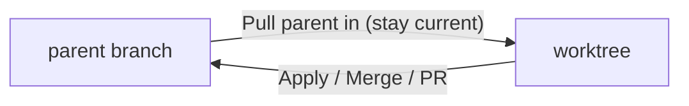

# Agent Manager Workflows

If you already use the sidebar chat and want to start running multiple agents in parallel, this page is the fastest path to productive. For the full reference of buttons and settings, see the [Agent Manager reference](/docs/automate/agent-manager).

## Sidebar vs. Agent Manager

- **Sidebar** — one agent on your current branch. Best for small, interactive tasks where you want tight feedback.
- **Agent Manager** — multiple agents, each in its own git worktree (its own branch checked out on disk). Best for long-running work, trying several approaches, or keeping side work isolated from your main branch.
- **Multiple sessions inside one worktree** (`Cmd+T` / `Ctrl+T`) — same branch, separate conversations. Useful for planner + implementer splits or read-only investigations alongside the main agent.

Rule of thumb: if you would stash or switch branches to do the work, create a worktree instead.


All Agent Manager sessions share a single `kilo serve` process. What each worktree isolates is the filesystem and git state — the branch, the directory, the terminal. API keys, models, and configuration are shared.


## What parallelizes well

Parallel work pays off when sessions are **independent** — neither one's output depends on the other, and they are unlikely to edit the same files.

- **Good candidates:** independent features, module-scoped refactors, a feature plus an unrelated bug fix, trying 2–4 approaches to the same problem.
- **Poor candidates:** tasks editing the same files, steps with tight sequential dependencies.
- **Always safe:** read-only work (investigation, code tours, running tests, log analysis). Nothing touches the filesystem, so multiple sessions on the same branch never collide.

## The default loop

Every productive worktree session follows the same rhythm:

1. **Create a worktree** (`Cmd+N` / `Ctrl+N`) and describe the task.
2. **Let the agent run.** Switch to another worktree, another session, or step away.
3. **Verify manually.** Before you trust "all tests pass", run the app with the run script (`Cmd+E` / `Ctrl+E`) or open the worktree's terminal (`Cmd+/` / `Ctrl+/`) and run the tests yourself.
4. **Review the diff** (`Cmd+D` / `Ctrl+D`). Drop inline comments, then **Send to chat** to feed them back to the agent.
5. **Iterate.** Re-run, re-review. Repeat until the diff is ready — not until the agent says it is done.
6. **Ship it.** See [Merging worktree and parent branch](#merging-worktree-and-parent-branch).

The single biggest lever on this loop is **keeping each worktree's scope small**. A small diff tests quickly, reviews quickly, and PRs quickly.

## Workflows

### 1. Side quest

Something unrelated came up while you are mid-task. Create a new worktree for it (`Cmd+N`), let the agent work, review when it is done. Your main work is unaffected.

### 2. Build a skeleton, then split the work

For multi-part features where several pieces share a few core contracts — types, API boundaries, folder layout:

1. Build the walking skeleton in one worktree or the sidebar. Update AGENTS.md with the conventions.
2. Merge it, then create one worktree per feature slice — each branched off the skeleton.
3. Merge slices in dependency order as each goes green.

This mirrors how a human team works: agree the API contract first, then split backend and frontend in parallel. The contract removes the need to coordinate mid-flight.

### 3. Multiple approaches in parallel

For genuinely hard tasks where you do not know which approach will work:

1. Open the advanced new-worktree dialog (`Cmd+Shift+N` / `Ctrl+Shift+N`) and pick 2–4 versions.
2. Optionally assign a different model to each.
3. Review the diffs side by side, pick the winner, apply it, discard the rest.

### 4. Continue in Worktree

A sidebar task grew bigger than planned. From the sidebar chat, choose **Continue in Worktree** — the session history and any uncommitted changes move into a new worktree, and the sidebar is free again.

A related pattern: use the sidebar as an investigation surface. Start two or three investigation chats in the sidebar, then promote only the ones worth pursuing into worktrees.

### 5. A worktree per bug

For a day of small fixes: one worktree per bug (`Cmd+N`), one branch per fix, merge each quickly so none drift. Close the worktree when the fix lands.

### 6. Multiple sessions on one branch

Press `Cmd+T` / `Ctrl+T` inside an existing worktree to open another session on the same branch. Useful for:

- **Planner + implementer.** One session researches or plans; the other implements with a clean context.
- **Fresh context on a long conversation.** Start a new tab, summarize the current state, continue there. The old session stays available.
- **Read-only investigations** alongside the main agent — always safe because nothing touches the filesystem.
- **Forked exploration.** Use **Fork Session** to spawn a new session seeded with an existing conversation, then steer it differently without losing the original.

Sessions sharing a branch can see each other's commits, so write-heavy work on the same branch needs a little coordination.

## Running and testing

- **Worktree terminal** (`Cmd+/` / `Ctrl+/`) — rooted at the worktree directory, so all commands scope to that branch. Use it for one-off tests, `git status`, reproducing a bug by hand.
- **Run script** — create `.kilo/run-script` (or `.ps1` / `.cmd` / `.bat` on Windows) and trigger it with `Cmd+E` / `Ctrl+E`. Runs in whichever worktree is selected. Gets `WORKTREE_PATH` and `REPO_PATH` in the environment.
- **Open in its own VS Code window** — right-click a worktree and choose **Open in VS Code** for a full editor rooted at the worktree path.

### Parallel worktrees need non-shared state

The moment two worktrees both try to use the same external resource — a port, a cache, an emulator, a container — they collide. Only one process can bind to `localhost:3000`; only one simulator can be "the simulator".

Two fixes, in order of preference:

1. **Change the app to read the address from the environment** with a free-port fallback. This solves the problem everywhere — Agent Manager, CI, tests, teammates — not just here.
2. **Assign a unique instance per worktree** in the run script, derived from `WORKTREE_PATH`.

The same applies to caches (avoid pointing `CARGO_TARGET_DIR` at a shared path), emulators (create a named simulator per worktree), and containers (use unique container names or `COMPOSE_PROJECT_NAME`).

## Reviewing changes

Layer review in before asking a teammate:

- **Diff panel** (`Cmd+D`) — live diff against the parent branch. Drag filenames into the chat input for `@file` mentions. Inline-comment the lines you want revisited, then **Send to chat** to iterate.
- **`/local-review-uncommitted`** — slash command, AI review of staged and unstaged changes in the worktree. Good as a last pass before committing.
- **`/local-review`** — slash command, AI review of the whole branch vs. its base.
- **`kilo review` in CI** — automated PR review. See [Code Reviews](/docs/automate/code-reviews/overview) for the setup.
- **Human review** — push the branch from the session terminal and `gh pr create`. The PR badge appears on the worktree and stays in sync with CI and reviews.

A typical sequence: self-review in the diff panel → `/local-review-uncommitted` → push → CI review → teammate review.

## Merging worktree and parent branch

Over a worktree's life you will merge in two directions: from the worktree back to its parent branch (integrating the work), and from the parent branch into the worktree (staying current). The parent branch is whatever branch the worktree was created from — often `main`, but not always. The examples below use `main`; substitute your actual parent branch where relevant.

### Worktree → parent branch

Three ways, pick based on how much collaboration the change needs:

- **Apply to local** — from the diff panel. Copies the worktree's changes onto your checkout of the parent branch. You can stop there, or commit and push from your normal terminal. Fastest path for solo work.
- **Merge directly** — from the session terminal: `git checkout main && git merge <branch>`. The natural flow on teams without a PR culture.
- **Open a PR** — `git push -u origin <branch> && gh pr create --fill` from the session terminal. The PR badge appears on the worktree and stays in sync with CI and reviews.

### Parent branch → worktree

When the parent branch moves ahead, ask the agent from the worktree's session:

> Merge the latest `origin/main` into this branch and resolve any conflicts. Do not use `git stash`.

Save this as a reusable slash command if you do it often.


**Never use `git stash` inside a worktree.** Stashes live in the shared `.git` directory that every worktree points at, so a stash made in one worktree can be popped in another — crossing uncommitted changes between agents. Use a WIP commit or a temporary branch instead.


### Resolving conflicts

The Agent Manager is good at conflict resolution when you give it context. A low-context ask ("fix the conflicts") often produces a result that compiles but silently drops one side's intent. Tell the agent what each branch was trying to do:

> I am merging `<branch>` into `<target>`. `<branch>` did X. `<target>` has since added Y. Both need to survive.

### When several worktrees finish at once

Merge the most foundational one first. Then, in each remaining worktree, ask the agent to pull the updated parent branch in (same prompt as above) before merging. The agent handles the merge direction and only escalates conflicts it cannot resolve.

## Hygiene

- Merge within a day or two. Past that, pull the parent branch into the worktree rather than letting it drift.
- After a branch merges, close the worktree from its context menu. The branch is preserved; the directory is removed.
- Do not run more than four or five agents at once. The practical limit is review and integration cost, not memory.

## Common mistakes

- **Too many agents.** Coordination overhead exceeds the throughput gain above four or five.
- **Overlapping file edits in parallel worktrees.** Worktrees isolate the filesystem, not the semantics — conflicts still happen at merge time.
- **Skipping manual verification.** Trust the agent, but confirm with the run script or terminal.
- **Stale shared context.** Update AGENTS.md before a swarm, not mid-flight.
- **Hardcoded shared state.** Fixed ports, fixed container names, "the simulator" — refactor to take values from the environment.
- **`git stash` inside a worktree.** Stashes cross between worktrees.

## Cheatsheet

| Situation                                              | Where                         |
| ------------------------------------------------------ | ----------------------------- |
| Small, interactive task                                | Sidebar                       |
| Long task, want to do something else meanwhile         | New worktree (`Cmd+N`)        |
| Two or three approaches, pick the winner               | Multi-version (`Cmd+Shift+N`) |
| Sidebar task outgrew the sidebar                       | Continue in Worktree          |
| Separate conversation on the same branch               | New tab (`Cmd+T`)             |
| Long conversation, want a fresh context on same branch | New tab, summarize            |
| Run the app to verify                                  | Run script (`Cmd+E`)          |
| One-off git or shell commands                          | Terminal (`Cmd+/`)            |
| Team review                                            | Push + `gh pr create`         |
| Ship without ceremony                                  | Apply to local                |

## Related

- [Agent Manager reference](/docs/automate/agent-manager)
- [Code Reviews](/docs/automate/code-reviews/overview)
- [Shell integration](/docs/automate/extending/shell-integration)
