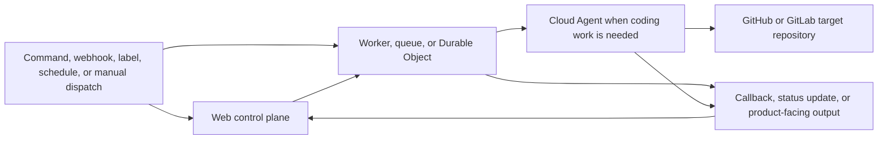
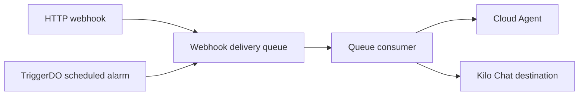

# Automation Services Architecture

Automation services turn commands, source-control events, labels, review requests, HTTP webhooks, and schedules into scoped work.


This page describes cloud automation boundaries present in `Kilo-Org/cloud`. Static source shows supported code paths, Worker bindings, and deployable surfaces. It does not prove live production enablement or rollout policy.


## How to use this page

Use this page for trigger-to-execution workflows: what starts work, which owner authorizes it, where orchestration state lives, when Cloud Agent launches, how output returns, and how stuck work recovers. Use [Cloud Platform](/docs/contributing/architecture/cloud-platform) for hosted service topology and [Cloud Security](/docs/contributing/architecture/cloud-security) for trust boundaries.

## Ownership model

Automation state and credentials are scoped to owner where supported. Owner is personal user or organization. Personal and organization paths stay separate so credentials, concurrency, findings, and callbacks do not collapse into global automation state.

| Dimension | Model |
|---|---|
| Owner scope | Personal user owner or organization owner, handled separately where supported |
| Source-control target | GitHub is primary across automation; GitLab target support exists in selected paths |
| Command ingress | GitHub, Slack, and Linear command surfaces are distinct from target repository support |
| Credentials | Web control plane resolves user, bot, or installation token and passes scoped access to Worker or Cloud Agent |
| Callback auth | Workers use internal secrets, service bindings, or per-run callback secrets depending on flow |
| Cloud Agent sandbox | Launches inherit policy-selected sandbox allocation and session-specific workspace paths; see [Cloud Agent](/docs/contributing/architecture/cloud-platform#cloud-agent) |

## Common lifecycle

Most automation paths follow same shape. Individual services can stop before Cloud Agent or select different destination.

| Stage | Responsibility |
|---|---|
| Trigger | Accept command, source-control event, label, webhook, schedule, or manual dispatch |
| Authorization owner | Resolve personal or organization scope and permitted credentials |
| Orchestration | Store durable work state and coordinate queues, Durable Objects, callbacks, and alarms |
| Execution target | Launch Cloud Agent only when repository or structured coding work requires it; some flows stop earlier or select another destination |
| Output | Post review, label, pull request, finding state, callback, or destination message |
| Recovery | Retry queue delivery, enforce timeout alarm, reconcile stale state, or dispatch next waiting item |

## Service inventory

| Service | Trigger | Orchestration boundary | Execution target | Output or recovery |
|---|---|---|---|---|
| Kilo Bot | GitHub, Slack, or Linear command ingress | Web control plane bot libraries | Cloud Agent for requested repository work | Command response and coding-session result |
| Code Review | Pull-request webhook or review dispatch | Database queue and `code-review-infra` Durable Object per review | Cloud Agent review session | Pull-request feedback; dispatch next waiting review |
| Auto Triage | GitHub issue event or dispatch queue | Web duplicate check and `auto-triage-infra` Durable Object per ticket | Cloud Agent only when classification session is needed | Labels, status, callback, and timeout alarm |
| Auto Fix | `kilo-auto-fix` label or dispatch rule | `auto-fix-infra` Durable Object per fix ticket | Cloud Agent branch and pull-request work | Pull request and lifecycle status callback |
| Security Agent | Interactive or scheduled Dependabot sync plus analysis queue | `security-sync` and `security-auto-analysis` Workers | Model triage in `security-auto-analysis`; Cloud Agent only for selected deep analysis | Finding state, audit records, and stale-analysis cleanup |
| Webhook Agent Ingest | HTTP webhook or scheduled alarm | `webhook-agent-ingest` queue and `TriggerDO` | Cloud Agent or Kilo Chat destination | Destination delivery and queue retry behavior |

## Kilo Bot ingress and source-control targets

Kilo Bot command ingress and repository target support are separate concerns.

| Concern | Current static-source statement |
|---|---|
| Command ingress | GitHub, Slack, and Linear are current Kilo Bot command surfaces |
| GitHub target | Supported across bot, review, triage, fix, security, and Cloud Agent paths |
| GitLab target | Supported in selected Cloud Agent and bot context paths |
| GitLab command ingress | GitLab repository support does not imply note or comment-triggered Kilo Bot commands |

Do not document GitLab issue notes or merge-request comments as current Kilo Bot trigger surfaces unless source adds explicit ingress handling.

## Code Review

Code Review queues pull-request work in database, enforces per-owner concurrency in Next.js dispatch layer, and starts `CodeReviewOrchestrator` Durable Object when slot is available.

| Concern | Behavior |
|---|---|
| Trigger | Pull-request webhook or review dispatch |
| Authorization owner | Per-owner dispatch slots separate concurrent review work |
| Queue | Reviews wait in database as pending rows |
| Orchestration | Durable Object keeps Cloud Agent connection alive |
| Output | Review feedback is posted back to pull request |
| Recovery | Worker updates database and triggers dispatch of next pending review |

## Auto Triage

Auto Triage classifies GitHub issues and applies labels or status updates. Duplicate check happens through web backend. Non-duplicate issues can launch Cloud Agent classification through prepare, initiate, and callback flow.

| Concern | Behavior |
|---|---|
| Trigger | GitHub issue event or dispatch queue |
| Duplicate check | Calls Next.js API and can complete without Cloud Agent |
| Execution | Cloud Agent session runs structured classification prompt when needed |
| Callback | `POST /tickets/:ticketId/classification-callback` with per-ticket secret |
| Output | High-confidence classification applies labels such as `kilo-auto-fix` for downstream Auto Fix |
| Recovery | Durable Object alarm marks stuck ticket failed |

## Auto Fix

Auto Fix receives dispatch requests when issues are selected for automated fixes. Durable Object manages fix session state, launches Cloud Agent, and reports status to backend.

| Concern | Behavior |
|---|---|
| Trigger | Label or dispatch rule selects issue for fixing |
| Orchestration | `AutoFixOrchestrator` owns fix session state |
| Execution | Cloud Agent creates branch and pull request |
| Output | Worker reports lifecycle updates to internal backend API |

## Security Agent

Security Agent splits finding sync from analysis. Findings, queue rows, and owner state remain scoped to personal or organization owner.

| Concern | Owner |
|---|---|
| Interactive finding sync | Web product checks owner integration permissions, fetches Dependabot alerts, normalizes results, and upserts findings |
| Scheduled finding sync | `security-sync` six-hour cron selects enabled GitHub security-scan owners and emits one owner-level queue message per owner |
| Scheduled sync consumer | `security-sync` filters owner repositories, resolves owner-scoped GitHub credentials through Git Token Service binding, and updates findings, SLA dates, and audit state through Hyperdrive |
| Analysis lifecycle | `security-auto-analysis` claims queued analysis rows, runs model triage, and launches Cloud Agent only when deep analysis is needed |
| Cleanup | Web cron reconciles stale `running` findings only when no matching queue row remains `pending` or `running` |

Static source proves scheduled sync and separate auto-analysis infrastructure. It does not prove newly synced findings are automatically enqueued for analysis. See [Cloud Platform](/docs/contributing/architecture/cloud-platform#security-agent) for durable topology and [Cloud Security](/docs/contributing/architecture/cloud-security#security-agent-sync-and-cleanup) for trust boundaries.

## App Builder orchestration boundaries

App Builder is prompt-driven product orchestration, not normal automation ingress. Cloud Agent owns generated-app coding and iteration. Preview, deployment build, and public deployed-app ingress use separate service boundaries. See [Cloud Platform](/docs/contributing/architecture/cloud-platform#app-generation-boundaries) for canonical phase topology and [Cloud Security](/docs/contributing/architecture/cloud-security#generated-application-preview-and-deployment) for trust boundaries.

## Webhook Agent Ingest

Webhook Agent Ingest handles configured trigger endpoints and schedules. `TriggerDO` stores trigger config and scheduled alarms. Queue consumer dispatches selected destination.

| Dimension | Variants | Notes |
|---|---|---|
| Activation | HTTP webhook | Can apply configured webhook authentication before queued delivery |
| Activation | Scheduled | Uses cron expression and Durable Object alarm; webhook auth is not applicable |
| Destination | `cloud_agent` | Launches Cloud Agent session with webhook or scheduled platform marker |
| Destination | `kiloclaw_chat` | Posts to user-scoped Kilo Chat destination through Kilo Chat service binding |

## Source map

Paths below are relative to [`Kilo-Org/cloud`](https://github.com/Kilo-Org/cloud).

| Service | Source paths |
|---|---|
| Kilo Bot | `apps/web/src/lib/bot/``apps/web/src/lib/bots/``apps/web/src/lib/slack-bot/` |
| Code Review | `apps/web/src/lib/code-reviews/``services/code-review-infra/` |
| Auto Triage | `apps/web/src/lib/auto-triage/``services/auto-triage-infra/` |
| Auto Fix | `apps/web/src/lib/auto-fix/``services/auto-fix-infra/` |
| Security Agent | `apps/web/src/lib/security-agent/``services/security-sync/``services/security-auto-analysis/` |
| App Builder preview | `apps/web/src/lib/app-builder/``services/app-builder/` |
| Generated-app deployment | `services/deploy-infra/builder/``services/deploy-infra/dispatcher/` |
| Webhook Agent Ingest | `services/webhook-agent-ingest/` |
| Cloud Agent | `services/cloud-agent-next/` |

## Related pages

- [Architecture Overview](/docs/contributing/architecture) - local and hosted execution map
- [Cloud Platform](/docs/contributing/architecture/cloud-platform) - hosted layers, Cloudflare terms, Cloud Agent topology, and adjacent hosted runtimes
- [Cloud Security](/docs/contributing/architecture/cloud-security) - trust boundaries, persistence, controls, privacy, and shared responsibility
- [Development Patterns](/docs/contributing/architecture/development-patterns) - choose code-ownership seam before changing architecture-facing contracts
