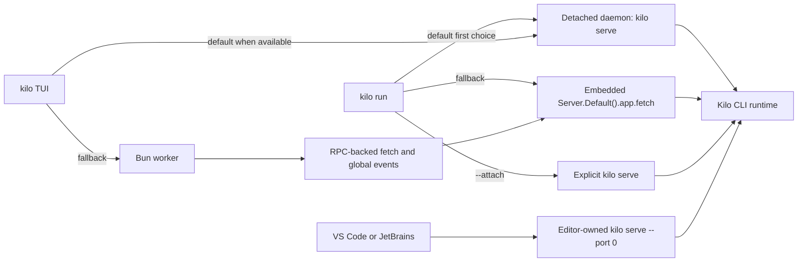
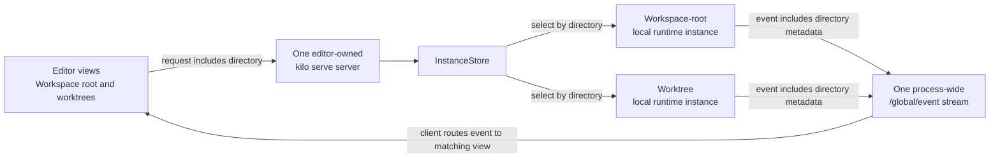

# CLI Runtime Architecture

The CLI (`packages/opencode/`) is Kilo Code's local agent engine. It owns agent execution, tools, sessions, provider integration, configuration, local persistence, directory routing, and HTTP surfaces used by editor clients and Kilo Console.


This page describes repository-defined local runtime behavior. It is not an endpoint catalog or a statement about cloud deployment configuration.


## Concepts

These terms describe local execution. They are separate from hosted Cloud Agent sessions described in [Cloud Platform](/docs/contributing/architecture/cloud-platform).

| Term | Meaning |
|---|---|
| Kilo CLI runtime | Local agent engine in `packages/opencode/` |
| `kilo serve` server | Local HTTP and SSE process used by editor clients and Kilo Console; selected browser-oriented paths also use WebSocket |
| Local daemon | Detached reusable `kilo serve` server managed by `kilo daemon` commands |
| Directory context | Normalized local filesystem directory used to select local runtime state |
| Local runtime instance | Directory-keyed runtime context inside one Kilo CLI process |
| Local routing workspace | Optional routing context that can resolve to a local directory or remote target |
| Worktree directory | Alternate git worktree path used as directory context for isolated concurrent work |
| Process-shared state | Runtime service state shared by every directory context in one Kilo CLI process |
| Modes | Configurable agent presets for tools, prompts, restrictions, and behavior |
| MCP | Protocol for extending agent tools |

One `kilo serve` process can host several local runtime instances. Directory-keyed state stays isolated. Process-shared service state does not.

## Command entry points

| Entry point | Command or caller | Runtime model |
|---|---|---|
| Interactive TUI | `kilo` | Attaches to local daemon when available; otherwise starts Bun worker and sends SDK-shaped requests over RPC |
| Headless run | `kilo run` | Uses daemon attach when available, then embedded server fetch fallback |
| Attached run | `kilo run --attach <url>` | Targets explicit running `kilo serve` server |
| Explicit API server | `kilo serve` | Starts HTTP + SSE server for external local clients |
| Local daemon | `kilo daemon start` | Starts detached `kilo serve` child for reuse |
| Browser console | `kilo console` | Starts or reuses local daemon and opens daemon-served `/console` UI |
| Editor-spawned server | VS Code or JetBrains client | Starts bundled `kilo serve --port 0` child owned by editor client, not local daemon manager |



TUI fallback is not direct call from UI thread to embedded fetch. UI thread starts `worker.ts`; worker RPC method constructs request, calls `Server.Default().app.fetch()`, and forwards global events back to UI thread.

## One server with multiple directory contexts

Each running editor host starts one editor-owned `kilo serve` server. That server can handle coding sessions for workspace root and additional worktree directories at same time. It does not start separate server process for each directory.



| Step | What happens | Why it matters |
|---|---|---|
| Send request | Editor client includes directory with local API request | CLI can distinguish workspace root from worktree directory |
| Select state | `InstanceStore` normalizes directory and selects directory-keyed local runtime instance | Sessions for alternate directories keep isolated runtime state |
| Return events | Server publishes event with directory metadata through shared `/global/event` SSE stream | Editor client routes event to matching directory and session view |

This distinction matters for Agent Manager worktrees and JetBrains workspace caches. Directory-keyed state stays isolated. Process-wide event stream and server-owned service state remain shared; snapshot slow-track guard is one example. Authentication, provider routing, SSE, and snapshots appear in later sections.

## Authentication boundaries

Three credential boundaries coexist. Keep them separate when tracing request path or changing authentication code.

| Boundary | Protects | Owner |
|---|---|---|
| Local `kilo serve` access | HTTP, SSE, and selected WebSocket access to local server | Kilo CLI server and spawning local client |
| Outbound provider authentication | Model provider, Kilo Gateway, catalog, and indexing access | Kilo CLI provider router and auth stores |
| Remote MCP OAuth | Browser authorization and credentials for remote MCP server | Kilo CLI MCP runtime |

### Local `kilo serve` access

Server Basic Auth is optional. It becomes required when `KILO_SERVER_PASSWORD` is non-empty. Default username is `kilo`; `KILO_SERVER_USERNAME` can override it.

| Path or mode | Authentication behavior |
|---|---|
| Normal HTTP and SSE | Basic `Authorization` header when server password is configured |
| Browser WebSocket | `auth_token` query parameter accepts base64 `username:password` because browser WebSocket constructors cannot set arbitrary headers |
| Public UI assets | Selected manifest and icon GET paths bypass Basic Auth so browser metadata can load |
| PTY ticket issue | Authenticated `POST /pty/{ptyID}/connect-token` requires expected ticket header and allowed origin |
| PTY ticket connect | `GET /pty/{ptyID}/connect?ticket=...` bypasses Basic middleware, then consumes single-use, scope-bound ticket in PTY handler |
| PTY shell child | Removes `KILO_SERVER_PASSWORD` and `KILO_SERVER_USERNAME` from spawned user-shell environment |

PTY connect supports two browser-oriented modes: loopback query credential mode (`auth_token`) used by current Console and VS Code Agent Manager paths, and short-lived ticket mode exposed by server API.

### Outbound provider authentication

Provider auth records use `api`, `oauth`, or `wellknown` variants in `${Global.Path.data}/auth.json`, written with mode `0600`. `KILO_AUTH_CONTENT` can supply process-local auth JSON. Separate v2 multi-account auth store also exists for account-oriented flows.

| Path | Behavior |
|---|---|
| Direct providers | Use provider-specific keys, OAuth records, environment values, and configured endpoints |
| Kilo Gateway | Resolves Kilo model access and model catalog through gateway client |
| Anonymous Kilo | If no Kilo key exists, provider loader sets API key value `anonymous`; gateway model catalog can fall back to public unauthenticated endpoint |
| Organization catalog | Kilo model fetch includes organization ID when resolved from config, auth, or environment |
| Model cache | Caches provider model results for five minutes; failed loads invalidate cache for retry |
| Custom endpoints | Provider config can override endpoint and credential options |
| Indexing auth | Resolves indexing-specific Kilo config first, then provider config, auth record, provider options, and `KILO_API_KEY` / `KILO_ORG_ID` environment values |

### Remote MCP OAuth

Remote MCP OAuth belongs to CLI runtime. Static headers remain supported. For OAuth servers, CLI handles browser authorization and stores credentials in protected local state; editor clients invoke CLI-owned flow instead of storing MCP credentials themselves.

## Directory routing and local runtime instances

Instance routes select directory context in this order:

1. `directory` query parameter.
2. `x-kilo-directory` request header.
3. Server process cwd.

Local routing workspace selection is separate. Session workspace, `workspace` query parameter, and `KILO_WORKSPACE_ID` can select workspace context. Configured `KILO_WORKSPACE_ID` keeps requests local to current workspace runtime. Other selected workspaces resolve through workspace-routing adapter to local directory or remote target.

| Request plan | Behavior |
|---|---|
| Local | Provides resolved directory and optional workspace ID to request handlers |
| Remote | Proxies HTTP or WebSocket request to adapter target |
| Missing workspace | Returns workspace-not-found response |
| Workspace-routing local | Keeps selected local routes and `/console` on local server instead of proxying |

Remote HTTP proxy responses can include sync fence metadata. Router waits for matching sync progress before returning. `InstanceStore` normalizes directory keys, deduplicates concurrent boots with deferred entry, and disposes directory state through registered cleanup hooks.

## Core subsystems

| Subsystem | Purpose |
|---|---|
| Agent runtime | Orchestrates messages, model calls, permissions, questions, and multi-step execution |
| Tool registry | Loads built-in, Kilo-specific, MCP, and readiness-gated semantic search tools |
| LSP client | Provides diagnostics and language intelligence |
| Config service | Merges global, project, organization, managed, and runtime inputs |
| Instance store | Caches normalized directory-scoped runtime contexts |
| SQLite and storage services | Persist structured records and remaining JSON-owned data |
| Snapshot service | Tracks git-backed file baselines for diffs and revert flows |
| Provider router | Resolves direct providers, Kilo Gateway, custom endpoints, and credentials |
| HTTP server | Publishes REST, WebSocket, and SSE surfaces |

## Daemon lifecycle

`kilo daemon start|status|stop|restart` manage detached local `kilo serve` child. `kilo console` calls same start path, so it reuses healthy daemon instead of spawning second process.

| Area | Behavior |
|---|---|
| State file | `${Global.Path.state}/daemon.json`, written with mode `0600` |
| Log file | `${Global.Path.log}/daemon.log`, created with mode `0600` |
| Port allocation | For `--port 0`, scans `4097..4116` and chooses available port |
| Child process | Detached `kilo serve --hostname <host> --port <port>` process |
| Health | Probes authenticated `/global/health` with 2 second timeout |
| Reuse | Reuses daemon only when process is alive, health succeeds, and installed version matches |
| Cleanup | Terminates stale process when present, clears stale state, then starts replacement |
| Opt-out | `KILO_NO_DAEMON` disables automatic attach by clients; explicit daemon commands still manage daemon |

Daemon credentials differ from editor-spawned server credentials. Current daemon source stores username `kilo`, password `kilo`, and base64 Basic token in `daemon.json`. File permissions protect this local credential record. Editor clients generate random passwords per spawned server.

## Persistence

SQLite is default structured store.

| Area | Behavior |
|---|---|
| Default database | `${Global.Path.data}/kilo.db` |
| Override | `KILO_DB`; relative paths resolve under data directory; `:memory:` is accepted |
| Runtime pragmas | WAL journal, normal sync, 5 second busy timeout, foreign keys, passive checkpoint, bounded cache |
| Schema changes | Drizzle migrations load from bundled journal in compiled binary or migration directories in development |
| Main tables | Projects, sessions, messages, parts, todos, permissions, session messages, workspaces, sync events, accounts, and account state |
| Legacy migration | On first database creation, CLI runs one-time JSON-to-SQLite migration for projects, sessions, messages, parts, todos, permissions, and shares |

Some JSON-backed storage remains. Session diffs still use storage path `session_diff`, and configuration, auth, and selected local state files retain their own owners. Snapshot storage is separate from SQLite and JSON storage.

## Snapshot state boundary

Snapshot baselines use separate git directory per project worktree:

```text
${Global.Path.data}/snapshot/<project-id>/<worktree-hash>
```

Snapshot implementation state is directory-keyed through `InstanceState`. One `Snapshot.Service` also owns process-shared slow-snapshot guard state outside directory cache. This distinction matters when multiple Agent Manager worktrees use same `kilo serve` process.

Slow initial tracking has guarded behavior:

| Condition | Behavior |
|---|---|
| Fast track | Returns snapshot hash normally |
| Slow interactive track | After default 10 seconds, can prompt to keep waiting or disable snapshots for project |
| Managed Agent Manager turn | Sends `snapshotInitialization: "wait"`; waits without inline question so concurrent started sessions retain baselines |
| Visible long track | Adds temporary progress part after short delay, updates spinner, and removes part when done |
| Disable choice | Writes `"snapshot": false` to project config without disposing active turn |
| Dismissed or untargeted timeout | Interrupts or skips track and suppresses repeat prompt for active service scope |

## SDK contract

CLI server contract flows through generated and handwritten layers:

1. Effect `HttpApi` groups under `packages/opencode/src/server/routes/instance/httpapi/` define routes.
2. `packages/opencode/src/server/routes/instance/httpapi/public.ts` normalizes public OpenAPI to legacy-compatible request and response shapes.
3. Kilo-specific API groups and handlers live under `packages/opencode/src/kilocode/server/httpapi/` and enter shared API through narrow injection seams.
4. `packages/sdk/js/script/build.ts` generates TypeScript v2 client from CLI OpenAPI.
5. `packages/sdk/js/src/v2/client.ts` adds `createKiloClient()` wrapper for directory and workspace routing, Electron and Node fetch compatibility, and clearer empty-response errors.
6. Root `./script/generate.ts` runs SDK generation, emits tracked OpenAPI artifact, updates CLI docs, and formats outputs.
7. JetBrains Gradle build generates build-local OpenAPI, normalizes it, and generates Kotlin OkHttp client.

Regenerate checked-in JavaScript SDK output after server endpoint changes. Do not hand-edit generated client files.

## Config precedence

Later sources override earlier values during instance config load:

| Order | Source |
|---|---|
| 1 | Legacy Kilo migrations |
| 2 | Organization modes |
| 3 | Auth-record `.well-known/opencode` remote config |
| 4 | Global config files |
| 5 | Explicit `KILO_CONFIG` file |
| 6 | Project `kilo.json[c]` and `opencode.json[c]` files plus discovered config directories |
| 7 | `KILO_CONFIG_DIR` directory |
| 8 | `KILO_CONFIG_CONTENT` |
| 9 | Active Kilo Cloud organization config |
| 10 | Managed config directory |
| 11 | macOS managed preferences |
| 12 | Runtime flag-derived permission, tool, compaction, and plugin behavior |

Global config files load from `${Global.Path.config}`. Project updates prefer existing config files found in ancestor `.kilo`, `.kilocode`, or `.opencode` directories, then existing project root config files, then create `.kilo/kilo.json`. Global indexing settings can carry provider and storage defaults, but global `indexing.enabled` is stripped so project enablement remains local in effective instance config.

Signed-in organization modes become normal agent configuration during load. They override migrated legacy modes and remain overridable by later config sources in table.

Runtime config loading is separate from editor-facing JSON Schema publication. Cloud-served schema improves validation and completion for `kilo.json` and `kilo.jsonc`; it does not load, apply, or override effective runtime config. When adding or changing config key, follow [CLI Config Schema](/docs/contributing/architecture/config-schema) so CLI source and cloud overlay stay aligned.

## Global and instance SSE

| Stream | Scope | Payload |
|---|---|---|
| `/event` | One local runtime instance bus | Direct event payloads until instance disposal |
| `/global/event` | Process-wide multiplexed bus | Wrapper with payload and available directory, project, and workspace metadata |

Both streams send initial `server.connected` event and heartbeat every 10 seconds. VS Code and JetBrains consume `/global/event` so one server connection can route events for multiple directories.

## Kilo Console

`kilo console` starts or reuses daemon, opens `/console`, and prints Console launch URL. Browser launch URL embeds daemon Basic credentials so initial request authenticates.

| Area | Behavior |
|---|---|
| Frontend | Solid/Vite app in `packages/kilo-console/` |
| Server route | `/console` assets resolved by CLI UI handler |
| Release build | CLI executable build copies Console assets beside binary under `bin/console` |
| SDK | Console calls generated JavaScript SDK through `createKiloClient()` |
| Discovery | Console scans `4097..4116` loopback daemon URLs, ranks healthy hits, then tries cached URL fallback |

Source development can serve built Console assets from package output or build them on demand. This is development behavior, not production deployment claim.

## Codebase indexing

`packages/kilo-indexing/` owns indexing engine. CLI bridge injects indexing plugin by default unless default plugins are disabled, then starts indexing asynchronously per normalized directory during instance bootstrap.

| Area | Behavior |
|---|---|
| Bootstrap | `KilocodeBootstrap` forks indexing initialization so instance startup is not blocked |
| Worker | Dedicated indexing worker owns `CodeIndexManager` and search calls |
| Cache | CLI bridge caches worker entry by directory and disposes it with instance |
| Status | `GET /indexing/status` and `indexing.status` bus event expose progress |
| Tool | `semantic_search` is registered only after indexing reports readiness |
| Worktrees | Agent Manager `.kilo/worktrees/` and legacy `.kilocode/worktrees/` paths return disabled status |
| Empty VS Code window | Extension sets `KILO_DISABLE_CODEBASE_INDEXING=vscode-no-workspace`; bridge reports disabled status |
| Embeddings | Supports Kilo, OpenAI, Ollama, OpenAI-compatible, Gemini, Mistral, Vercel AI Gateway, Bedrock, OpenRouter, and Voyage configuration |
| Vector stores | Supports Qdrant and LanceDB |

## Source map

Paths below are relative to [`Kilo-Org/kilocode`](https://github.com/Kilo-Org/kilocode).

| Concern | Source paths |
|---|---|
| CLI entry points | `packages/opencode/src/cli/cmd/` |
| Daemon | `packages/opencode/src/kilocode/daemon/` |
| HTTP server | `packages/opencode/src/server/` |
| Directory and workspace routing | `packages/opencode/src/server/routes/instance/httpapi/middleware/workspace-routing.ts` |
| SQLite | `packages/opencode/src/storage/db.ts` |
| Snapshots | `packages/opencode/src/snapshot/index.ts``packages/opencode/src/kilocode/snapshot/track.ts` |
| SDK | `packages/sdk/js/``script/generate.ts` |
| Console | `packages/kilo-console/``packages/opencode/src/kilocode/console/` |
| Indexing | `packages/kilo-indexing/``packages/opencode/src/kilocode/indexing.ts` |

## Related pages

- [Architecture Overview](/docs/contributing/architecture) - local and hosted execution map
- [VS Code Extension](/docs/contributing/architecture/vscode-extension) - extension-host ownership, Agent Manager, and webview bridge
- [JetBrains Plugin](/docs/contributing/architecture/jetbrains-plugin) - split-mode client, bundled server lifecycle, and workspace cache
- [Development Patterns](/docs/contributing/architecture/development-patterns) - API generation, code-ownership seams, and fork-maintenance rules
- [CLI Config Schema](/docs/contributing/architecture/config-schema) - editor validation contract for CLI config keys
