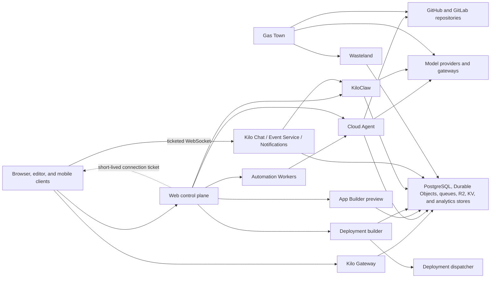
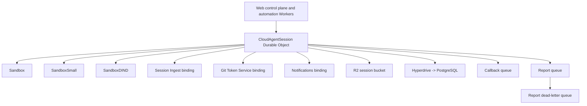
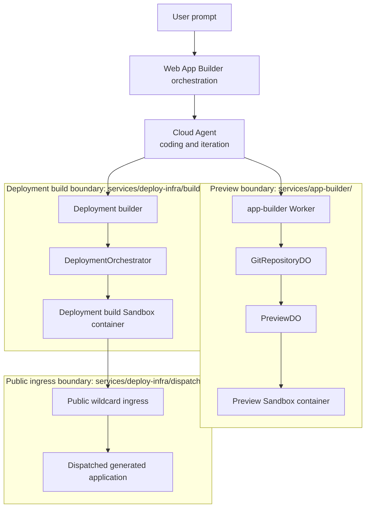
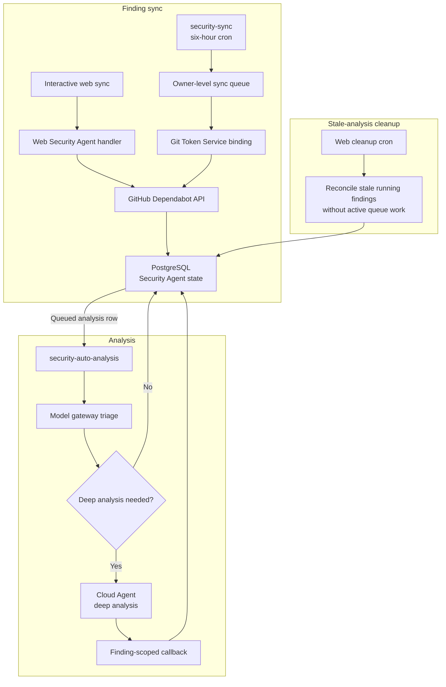
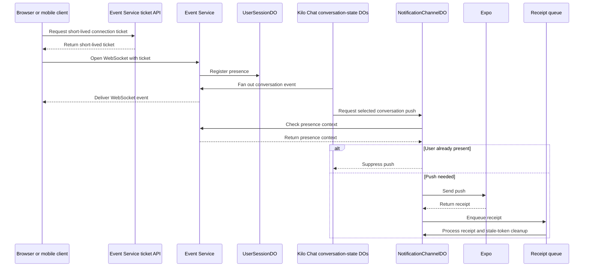
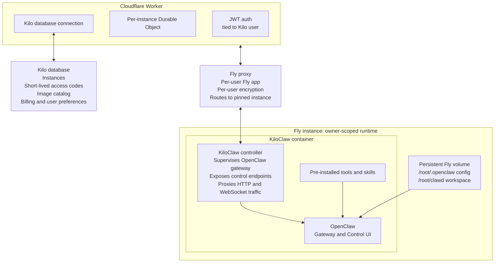
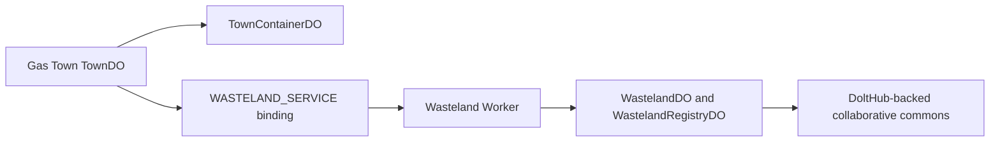

# Cloud Platform Architecture

Kilo Cloud is hosted platform layer for authentication, model routing, billing, product configuration, automation, and scoped execution services. Cloud implementation lives in open-source [`Kilo-Org/cloud`](https://github.com/Kilo-Org/cloud) repository.


This page describes Worker surfaces, bindings, routes, and code paths present in `Kilo-Org/cloud`. Static source shows deployable architecture, not live production enablement, rollout percentages, retention configuration, or vendor settings. Validate live environment before making production or compliance claims. Use [Kilo Cloud Security Architecture](/docs/contributing/architecture/cloud-security) for trust boundaries and data flows.


## How to use this page

Use this page to understand hosted service topology: which product boundaries exist, where long-running work executes, and how hosted runtimes relate. For trigger-to-execution workflows, continue to [Automation Services](/docs/contributing/architecture/automation-services). For trust boundaries and controls, continue to [Cloud Security](/docs/contributing/architecture/cloud-security).

## Hosted layers

| Layer | Responsibility | Examples |
|---|---|---|
| Web control plane | Identity, organization authorization, billing, product configuration, and API orchestration | Next.js application in `apps/web/` |
| Shared cloud services | Model routing, asynchronous orchestration, real-time delivery, persistence adapters, and operational services | Kilo Gateway, Workers, queues, Durable Objects, R2, KV, Hyperdrive |
| Scoped execution | Runs code or owner-scoped runtime workloads | Cloud Agent, App Builder preview sandbox, deployment builder sandbox, KiloClaw runtime, Gas Town container |
| External providers | Services outside Kilo Cloud trust boundary | Model providers, source-control providers, messaging providers, telemetry providers |

Where these pages say `owner`, they mean personal user or organization that authorizes scoped product state and credentials.

## Cloudflare terms

| Term | Meaning in these docs |
|---|---|
| Worker | Deployed service boundary that handles HTTP requests, queue messages, schedules, or service-binding calls |
| Durable Object | Stateful Cloudflare actor with stable identity, storage, and alarm support |
| Queue | Asynchronous delivery boundary used to separate ingress from long-running work |
| Dead-letter queue | Queue for messages that exhausted normal delivery attempts |
| Service binding | Direct Worker-to-Worker call boundary configured in Wrangler |
| R2 | Object storage for scoped blobs, assets, attachments, or export data |
| KV | Distributed key-value storage for cache, mapping, rollout, and dedup state; not strongly consistent authority |
| Hyperdrive | Cloudflare binding used to connect Workers to PostgreSQL |
| Sandbox | Isolated container execution binding used by selected hosted workloads |

## Product topology

Not every hosted flow launches Cloud Agent. Shared services also route model requests, deliver chat events, dispatch notifications, serve generated applications, and coordinate owner-scoped runtimes.

## Service families

| Family | Primary services | Role |
|---|---|---|
| Session execution | `cloud-agent-next``session-ingest``git-token-service``notifications` | Hosted coding sessions, session ingestion, repository credentials, and completion push |
| Automation | `code-review-infra``auto-triage-infra``auto-fix-infra``security-auto-analysis``security-sync``webhook-agent-ingest` | Queue-backed review, triage, fix, security, and configured trigger flows |
| App generation | `app-builder``db-proxy``images-mcp``deploy-infra/builder``deploy-infra/dispatcher` | Generated-app preview, data access, image tools, build orchestration, and deployed-app ingress |
| KiloClaw | `kiloclaw``kiloclaw-billing``gmail-push``kiloclaw-inbound-email` | Owner-scoped assistant runtime coordination, billing, and external ingress |
| Real-time chat | `kilo-chat``event-service``notifications` | Conversation state, WebSocket delivery, and mobile push |
| Multi-agent orchestration | `gastown``wasteland` | Town execution and collaborative commons |
| Evaluation and operations | `o11y``kilo-ops``model-eval-ingest` | Metrics, alerts, operations, and model-evaluation ingestion |
| Attribution | `ai-attribution` | AI-edit attribution events |

## Kilo Gateway

Gateway consists of cloud API routes plus `packages/kilo-gateway/` client integration in `Kilo-Org/kilocode`. It handles account-aware and anonymous-free model access. See [Cloud Security](/docs/contributing/architecture/cloud-security#model-request-gateway) for request branches and endpoint families.

| Responsibility | Description |
|---|---|
| Authentication | Resolves signed-in account and organization context when required |
| Anonymous free access | Allows eligible free-model requests without account auth under IP-derived context and limits |
| Provider routing | Routes managed-key, BYOK, custom-endpoint, and configured-gateway requests |
| Catalogs | Serves model, provider, embedding-model, and transcription-model surfaces |
| Usage and billing | Records applicable token usage, credits, entitlements, and billing metadata |

Auto Model clients send stable `kilo-auto/*` tier IDs. Gateway resolves tiers server-side before provider routing so mappings can change without client releases. See [Models and Providers](/docs/gateway/models-and-providers#auto-models) for current tier behavior.

Eligible gateway requests can include normalized project label for usage attribution and grouping. Label identifies project without sending full repository URL.

## Cloud Agent

`services/cloud-agent-next/` is current Cloud Agent session runtime. Each launched unit is a Cloud Agent execution session. Runtime uses queue-first orchestration and session messages.

Every Cloud Agent execution session receives separate workspace and home paths. Policy-selected sandbox allocation is not universally one container per session.

| Layer | Isolation rule |
|---|---|
| Working directory | Separate per execution session |
| Home directory | Separate per execution session |
| Git workspace | Separate per execution session |
| Sandbox identity | Policy-selected |
| Default allocation | May share owner-scoped sandbox across sessions |
| Selected organization flows | May use per-session sandbox |
| Devcontainer flows | Use per-session DIND sandbox |

`services/cloud-agent-next/wrangler.jsonc` defines these bindings. Presence in Wrangler config proves deployable topology, not active production allocation counts or rollout policy.

## Automation boundaries

[Automation Services](/docs/contributing/architecture/automation-services) owns trigger, owner-scope, queue, callback, output, and recovery details. This table only shows how automation relates to hosted platform.

| Service | Hosted execution relationship |
|---|---|
| Kilo Bot | Launches Cloud Agent for requested repository work |
| Code Review | Runs queued review sessions through Cloud Agent |
| Auto Triage | Can classify issue without Cloud Agent during duplicate check; launches Cloud Agent when classification session is needed |
| Auto Fix | Launches Cloud Agent to create issue-fix pull request |
| Security Agent | Runs model triage in `security-auto-analysis`; launches Cloud Agent only for selected deep analysis |
| Webhook Agent Ingest | Delivers configured prompt to Cloud Agent or Kilo Chat destination |

## App generation boundaries

App Builder is product orchestration, not normal automation ingress.

| Boundary | Ownership |
|---|---|
| Coding and iteration | Cloud Agent edits generated application code |
| Preview | `services/app-builder/` owns preview routing and preview sandbox containers |
| Deployment build | `services/deploy-infra/builder/` owns build orchestration in separate sandbox boundary |
| Public deployed-app ingress | `services/deploy-infra/dispatcher/` owns wildcard ingress and dispatch namespace routing |

## Webhook Agent Ingest

`services/webhook-agent-ingest/` is configured-trigger boundary. It accepts HTTP webhooks and scheduled alarms, then dispatches selected Cloud Agent or Kilo Chat destination. [Automation Services](/docs/contributing/architecture/automation-services#webhook-agent-ingest) owns activation, authentication, queue, and alarm details.

## Security Agent

Security Agent keeps finding sync, analysis dispatch, and sandbox execution separate.

PostgreSQL holds owner-scoped findings, analysis queue rows, owner pause or block state, Security Agent configuration, and audit records. See [Automation Services](/docs/contributing/architecture/automation-services#security-agent) for queue lifecycle and its static-source limitation, and [Cloud Security](/docs/contributing/architecture/cloud-security#security-agent-sync-and-cleanup) for trust boundaries.

## Chat events and notifications

Kilo Chat stores conversation state in Durable Objects and fans events out through Event Service. Notifications checks Event Service presence context before selected pushes and processes Expo receipts asynchronously. See [Cloud Security](/docs/contributing/architecture/cloud-security#chat-events-and-notifications) for ticket and push-delivery trust boundaries.

## KiloClaw

KiloClaw is owner-scoped hosted OpenClaw runtime coordination. Durable Objects track instance lifecycle, routing, configuration, and reconciliation. Runtime provider support includes Fly, docker-local development, and Northflank paths; source support does not prove active provider rollout. See [Cloud Security](/docs/contributing/architecture/cloud-security#kiloclaw-ingress) for ingress controls.

| Ingress path | Auth or validation | Entry boundary | Async handoff | Target |
|---|---|---|---|---|
| Browser request | JWT auth | KiloClaw proxy | None | Owner-scoped runtime |
| One-time access code | Redeemed code and auth cookie | Access gateway | None | Owner-scoped OpenClaw UI |
| Controller machine check-in | Machine API key and derived gateway token | KiloClaw controller route | None | Owner-scoped runtime controller |
| Kilo Chat RPC | Service binding | KiloClaw binding | None | Owner-scoped runtime |
| Cloudflare Email Routing | Alias lookup and bounded parse | `kiloclaw-inbound-email` | Queue | KiloClaw platform service |
| Gmail Pub/Sub push | Google OIDC validation | `gmail-push` | Queue | Owner-scoped runtime controller |

KiloClaw resolves owner or instance scope before runtime delivery. Table compares ingress boundaries; it does not describe global shared destinations.

### Fly-provider topology example

## Gas Town and Wasteland

Gas Town is multi-agent orchestration for coding work on repositories. `TownDO` owns town state and `TownContainerDO` owns town container execution. Active town work uses 5-second alarm cadence. Idle towns use 5-minute cadence.

| Gas Town concept | Role |
|---|---|
| Town | Workspace or project with one or more rigs |
| Rig | Repository attached to town |
| Bead | Unit of work such as issue, task, merge request, or message |
| Convoy | Related beads with dependency tracking |
| Mayor | Persistent coordinator that decomposes and delegates work |
| Polecat | Worker agent that edits code and creates pull requests |
| Refinery | Review agent that runs quality gates and handles merge flow |
| Triage | Ephemeral agent for ambiguous automated-check outcomes |

Gas Town binds separate `wasteland` Worker through `WASTELAND_SERVICE`. Wasteland uses `WastelandDO` and `WastelandRegistryDO` Durable Objects and DoltHub-backed collaborative commons paths.

## Observability

`services/o11y/` is current metrics and alert infrastructure. Higher-order agent outcome analysis remains roadmap work unless backed by separate implementation.

| Surface | Static-source behavior |
|---|---|
| Alert evaluation | Worker cron runs every minute |
| API metrics | Analytics Engine dataset plus Pipeline stream |
| Session metrics | Analytics Engine dataset plus Pipeline stream |
| Export | Pipelines dual-write R2 Parquet data for Snowflake export infrastructure |
| Alert deduplication | KV namespace stores TTL-based cooldown state |
| Alert configuration | `AlertConfigDO` stores strongly consistent config |
| Session connection | `session-ingest` binds to `o11y` and emits session metrics |

## Source map

Paths below are relative to [`Kilo-Org/cloud`](https://github.com/Kilo-Org/cloud).

| Concern | Source paths |
|---|---|
| Cloud Agent session service and bindings | `services/cloud-agent-next/``services/cloud-agent-next/wrangler.jsonc` |
| Session ingestion and Git tokens | `services/session-ingest/``services/git-token-service/` |
| Automation Workers | `services/code-review-infra/``services/auto-triage-infra/``services/auto-fix-infra/``services/webhook-agent-ingest/` |
| Security Agent | `apps/web/src/lib/security-agent/``services/security-auto-analysis/``services/security-sync/` |
| App generation and deployment | `services/app-builder/``services/db-proxy/``services/images-mcp/``services/deploy-infra/` |
| KiloClaw | `services/kiloclaw/``services/kiloclaw-billing/``services/gmail-push/``services/kiloclaw-inbound-email/` |
| Chat, events, and notifications | `services/kilo-chat/``services/event-service/``services/notifications/` |
| Multi-agent orchestration | `services/gastown/``services/wasteland/` |
| Observability and operations | `services/o11y/``services/kilo-ops/``services/model-eval-ingest/` |
| Attribution | `services/ai-attribution/` |

## Related pages

- [Architecture Overview](/docs/contributing/architecture) - local and hosted execution map
- [Automation Services](/docs/contributing/architecture/automation-services) - trigger-to-execution workflows, queue ownership, callbacks, and recovery
- [Cloud Security](/docs/contributing/architecture/cloud-security) - trust boundaries, persistence, controls, privacy, and shared responsibility
- [Development Patterns](/docs/contributing/architecture/development-patterns) - choose code-ownership seam before changing architecture-facing contracts
