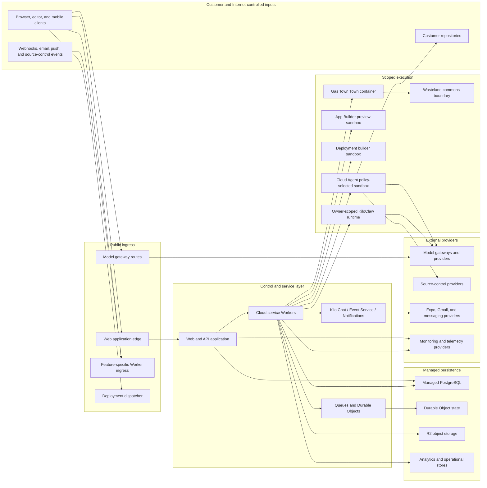
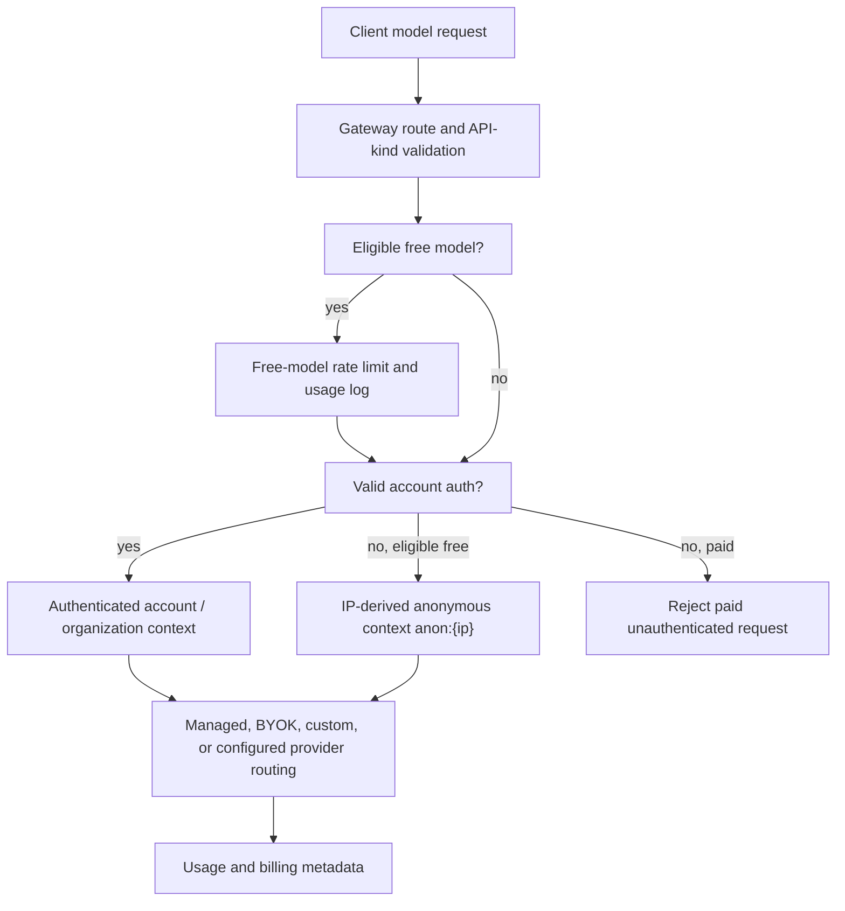
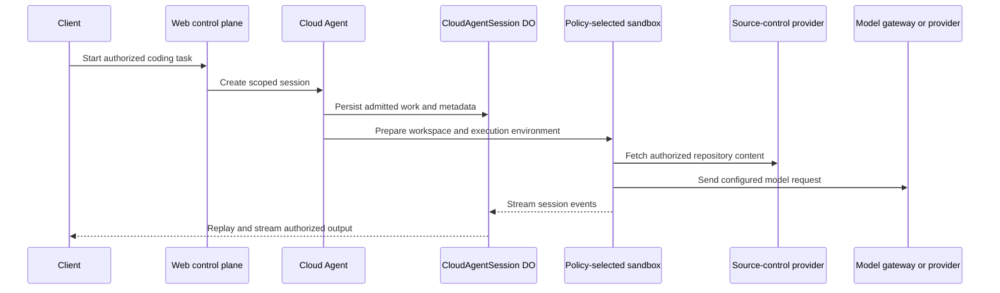
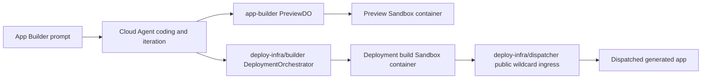
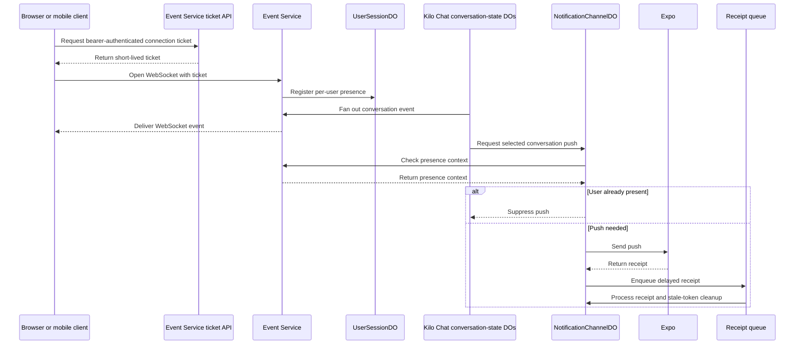
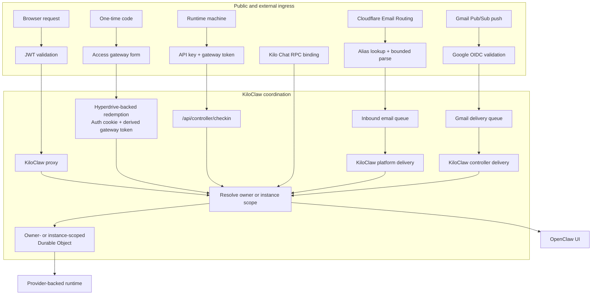

# Kilo Cloud Security Architecture

This page gives contributors and customer security reviewers a high-level view of Kilo Cloud security architecture. It covers logical topology, trust boundaries, data flows, persistence, execution isolation, external integrations, and shared responsibility.


This overview is based on deployable code and configuration in open-source `Kilo-Org/cloud` repository. Static source does not prove live production enablement, rollout percentages, exact regions, retention enforcement, backup policy, WAF rules, credential rotation, or vendor settings. Validate those against live production inventory before making contractual, production, or compliance claims.



Cloud contributors should read [Cloud Platform](/docs/contributing/architecture/cloud-platform) first, then use this page as cross-cutting security reference. Security reviewers can start here: selected security-specific flows repeat so trust boundaries remain understandable, while linked platform sections provide full topology detail. Use [Automation Services](/docs/contributing/architecture/automation-services) for trigger, queue, callback, and recovery details.


## Executive overview

Kilo Cloud combines web control plane with Cloudflare-hosted services and scoped execution environments.

- Browser, editor, and mobile clients connect to public application, gateway, and event surfaces.
- Vercel-hosted Next.js application provides account management, organization authorization, billing, product configuration, and API orchestration.
- Cloudflare Workers provide feature-specific ingress, service bindings, queue-backed workflows, durable coordination, real-time streams, and selected sandbox orchestration.
- Managed PostgreSQL stores relational control-plane records. Durable Objects, queues, KV, R2, and feature-specific analytical stores hold scoped state.
- Cloud Agent coding sessions run in Cloudflare sandbox containers with session-specific workspaces and policy-selected sandbox allocation.
- Generated-app preview and deployment builds run in boundaries separate from Cloud Agent coding sessions.
- KiloClaw assistant instances run in owner-scoped provider-backed runtimes with instance-scoped storage and encrypted configuration delivery.
- Gas Town binds to Wasteland as separate multi-agent orchestration boundary.

## Logical topology

| Layer | Security relevance |
|---|---|
| Client applications | User-controlled environments where authentication begins |
| Web control plane | Identity, organization authorization, billing, configuration, and API orchestration |
| Cloud service layer | Authenticated APIs, asynchronous workflows, durable coordination, streaming, and integration delivery |
| Managed persistence | Scoped records, durable state, queue delivery, object storage, and operational telemetry |
| Cloud Agent execution | Policy-selected sandbox containers with session-specific workspace and home directory |
| Generated-app preview | App Builder preview `Sandbox` container reached through preview routing |
| Generated-app deployment | Deployment builder `Sandbox` container plus dispatcher public wildcard ingress |
| KiloClaw execution | Owner-scoped provider-backed runtime with persistent storage |
| Gas Town and Wasteland | Town-owned container execution plus separate collaborative commons Worker |
| External providers | Third-party trust boundaries invoked by enabled capabilities |

## Trust boundaries

| Boundary | What crosses it | Primary controls |
|---|---|---|
| Clients to public application surfaces | Sessions, bearer tokens, requests, WebSockets, and customer input | Session or token validation, organization-aware authorization, security headers, short-lived event tickets, and selected origin allowlists |
| External systems to feature ingress | Webhooks, inbound email, Gmail Pub/Sub push, and source-control events | Provider proof where applicable, optional customer webhook secret, bounded payload handling, validation, idempotency, and queued processing |
| Web control plane to Workers | Session preparation, orchestration, integration delivery, and callbacks | Service credentials, scoped callback tokens, or Cloudflare service bindings by flow |
| Workers to persistence | Relational records, Durable Object state, queue messages, objects, and telemetry | Scoped identifiers, schema validation, service-specific authorization, and feature storage separation |
| Control plane to Cloud Agent | Repository metadata, task input, credentials, and runtime configuration | Policy-selected sandbox identity, session-specific paths, and just-in-time scoped credentials |
| Control plane to generated-app preview | Generated source and preview request traffic | App Builder `PreviewDO`, preview routing, bearer-protected status APIs, and separate preview sandbox |
| Control plane to deployment builder | Generated source and build input | `DeploymentOrchestrator`, build sandbox container, and deployment event callbacks |
| Internet to deployed applications | Public wildcard deployed-app requests | Dispatcher routes, dispatch namespace, KV mappings, and dispatcher rate limit |
| Control plane to KiloClaw runtime | Owner routing, config, proxy traffic, and machine lifecycle | JWT auth, one-time code redemption, derived gateway tokens, machine API keys, Durable Object owner scope, and encrypted config delivery |
| Gas Town to Wasteland | Collaborative orchestration operations | `WASTELAND_SERVICE` binding and separate Wasteland Durable Objects |
| Kilo Cloud to third parties | Repository operations, model requests, billing, notifications, and telemetry | Provider credentials, opt-in where applicable, scoped tokens, and feature-specific routing |

## Identity and access

Web control plane uses JWT-backed application sessions and supports multiple sign-in methods. Repository-supported providers include Google, Apple, GitHub, GitLab, Discord, LinkedIn OpenID Connect, WorkOS enterprise SSO, and email magic links.

Kilo Cloud uses several authorization contexts:

- Browser sessions for web product use.
- Signed bearer tokens for non-browser clients and selected cloud services.
- Organization membership and role checks for tenant-scoped operations.
- Administrative authorization for restricted operations.
- Internal service credentials, callback tokens, and Cloudflare service bindings.
- Short-lived one-time Event Service connection tickets.
- Provider-specific signature or token checks on supported external ingress.

Application records commonly scope to user or organization. Cloud Agent durable state scopes to session while sandbox allocation remains policy-selected. KiloClaw runtime scopes to owner or instance rather than global assistant process.

## Data and persistence

| Data category | Examples | Processing context |
|---|---|---|
| Identity and account | Email, name, profile metadata, provider links, and account state | Sign-in, account administration, support, and privacy flows |
| Organization and access | Membership, roles, invitations, SSO domains, and audit actors | Tenant authorization and enterprise administration |
| Billing | Customer IDs, subscription state, transaction references, and invoices | Entitlement, reconciliation, and financial record keeping |
| Usage and operations | Model, token counts, costs, feature status, session IDs, timestamps, and error summaries | Metering, support, and reliability |
| Repository and automation | Repository metadata, refs, issue or review context, webhook payloads, and findings | Source control, Cloud Agent work, review automation, and security features |
| AI and session content | Prompts, responses, conversation history, attachments, and session events | Inference, Cloud Agent sessions, KiloClaw, and enabled experiments |
| Integration config | OAuth metadata, provider config, webhook settings, and customer secrets | Enabled integrations and owner-scoped runtime config |
| Network and abuse telemetry | IP address, user agent, browser signals, and risk metadata | Abuse prevention, fraud controls, and investigation |
| Mobile and notification | Device tokens, notification status, and mobile-store transaction metadata | Mobile auth, subscriptions, and notifications |

| Persistence surface | Primary role | Security review note |
|---|---|---|
| Managed PostgreSQL | Relational system of record and workflow state | Vendor, regions, backups, and network controls require live validation |
| Durable Objects | Scoped coordination and feature state | Used for sessions, chat, notifications, ingestion, preview, and orchestration |
| Queues | Async processing, retries, and dead-letter handling | Used to separate public ingress and long-running work |
| R2 | Session blobs, attachments, feature assets, templates, and telemetry export | Bucket lifecycle, encryption, residency, and deletion require live validation |
| KV | Cache, rollout, mapping, and dedup state | Not strongly consistent authority |
| Analytical stores | Analytics Engine datasets, Pipeline export, and optional specialized stores | Active providers and retention require live validation |
| Runtime storage | Owner-scoped KiloClaw workspace and config persistence | Separate execution boundary tied to assigned runtime provider |

## Core data flows

### Model request gateway

Gateway exposes endpoint families for chat API kinds, autocomplete, transcription, embeddings, catalogs, anonymous free access, custom LLM endpoints, and BYOK routing.

| Family | Static-source surfaces |
|---|---|
| Chat APIs | `/api/gateway` and `/api/openrouter` aliases for chat completions, responses, and messages |
| FIM and edit | `/api/fim/completions`, `/api/edit/completions` |
| Transcription | Audio transcription routes |
| Embeddings | Embedding proxy routes |
| Catalogs | Models, transcription models, embedding models, providers, models-by-provider, and validation routes |
| Provider choice | Managed provider path, direct BYOK, custom LLM endpoint, organization settings, and configured gateway paths |
| Anonymous free | Eligible free-model requests only, with IP-derived context and limits |

Authenticated and anonymous requests diverge after model eligibility and free-model limit checks.

Static source details:

- Paid model requests require authentication.
- Anonymous access applies only to eligible free models.
- Anonymous context derives from request IP and uses synthetic ID format `anon:{ip_address}`.
- Free-model requests use rate limits. General path checks IP-based usage; server-side feature traffic from Cloudflare IPs can use user-based limits.
- Anonymous free requests also use promotion limit by IP.
- `free_model_usage` records support limits. `apps/web/vercel.json` defines hourly cleanup cron and cleanup route code removes rows older than seven days in batches.

Seven-day cleanup is code-defined retention path, not proof of live retention execution. Validate deployed cron and database policy before external retention claim.

### Cloud Agent session

Every Cloud Agent execution session receives separate workspace and home paths. Policy-selected sandbox allocation is not universally one container per session. Default allocation may share owner-scoped sandbox across sessions; selected organization flows may use per-session sandbox; devcontainer flows use per-session DIND sandbox. See [Cloud Agent](/docs/contributing/architecture/cloud-platform#cloud-agent) for canonical topology, isolation matrix, and binding inventory.

### Generated application preview and deployment

App Builder orchestrates prompt-driven product flow. Cloud Agent owns coding and iteration only. `services/app-builder/` owns preview routing and preview sandbox; `services/deploy-infra/builder/` owns deployment build sandbox; `services/deploy-infra/dispatcher/` owns public deployed-app ingress. See [App generation boundaries](/docs/contributing/architecture/cloud-platform#app-generation-boundaries) for canonical phase topology. Deployment builder config enables Sentry instrumentation; static source currently includes `sendDefaultPii: true`. Treat deployment telemetry payload shape, masking, access, and retention as review item, not assumed privacy property.

### Chat events and notifications

Kilo Chat binds to Event Service and Notifications. Event Service consumes one-time tickets before WebSocket upgrade and places connections in per-user Durable Objects. Notifications service uses per-user Durable Objects, checks presence context for conversation pushes, sends Expo push, and processes delayed receipts. See [Chat, events, and notifications](/docs/contributing/architecture/cloud-platform#chat-events-and-notifications) for canonical service topology.

### KiloClaw ingress

KiloClaw separates lifecycle coordination from runtime process. Fly is provider path and legacy fallback, docker-local supports development, and Northflank support exists in provider model. Active rollout must be checked in live environment. See [KiloClaw](/docs/contributing/architecture/cloud-platform#kiloclaw) for canonical runtime topology.

### Gas Town and Wasteland

Gas Town and Wasteland are separate trust boundaries. Gas Town owns town state and container execution. It calls Wasteland through `WASTELAND_SERVICE` binding; Wasteland owns separate Durable Objects and DoltHub-backed collaborative commons paths. See [Gas Town and Wasteland](/docs/contributing/architecture/cloud-platform#gas-town-and-wasteland) for canonical topology and orchestration concepts.

### Security Agent sync and cleanup

Security Agent interactive web sync and scheduled Worker sync are separate paths. `services/security-sync` config defines six-hour cron, owner-level queue, Hyperdrive access, and Git Token Service binding. `apps/web/vercel.json` defines stale cleanup every 15 minutes. Cleanup marks stale `running` findings failed only when no matching queue row remains `pending` or `running`. Static source does not prove scheduled sync enqueues newly synced findings for auto-analysis.

| Boundary | Control |
|---|---|
| GitHub vulnerability access | Installation tokens and `vulnerability_alerts` permission |
| Owner scope | Findings, analysis queue rows, sync queue messages, and owner state scope to one user or organization owner |
| Scheduled sync credentials | Git Token Service binding resolves owner-scoped GitHub credentials |
| Internal worker calls | Bearer auth, internal API secret, or service bindings depending on flow |
| Analysis callback | Derived callback token scopes completion to Security Agent callback and finding ID |
| Sandbox execution | Optional deep analysis inherits Cloud Agent policy-selected sandbox allocation and session-specific workspace isolation |
| Auditability | Finding sync and analysis activity write to Security Agent audit surfaces |

See [Cloud Platform](/docs/contributing/architecture/cloud-platform#security-agent) for topology and [Automation Services](/docs/contributing/architecture/automation-services#security-agent) for queue ownership.

## Observability

Observability is a security-review boundary because operational metrics and exports can contain customer-linked identifiers and diagnostic content. `services/o11y/` defines Worker-backed metrics, alerts, Analytics Engine datasets, Pipeline streams, R2 Parquet export infrastructure, KV cooldown state, and `AlertConfigDO`. See [Observability](/docs/contributing/architecture/cloud-platform#observability) for canonical topology. Active providers, access, filtering, and retention require live validation.

Higher-order agent outcome analysis is roadmap work unless separate source proves implementation.

## Security controls summary

| Control area | Architecture-level control |
|---|---|
| Authentication | JWT-backed sessions, bearer tokens, machine tokens, one-time code redemption, and provider-specific ingress proof |
| Authorization | User, organization, role, owner, instance, and administrative checks by operation |
| Abuse prevention | Turnstile, fraud telemetry, blocking logic, free-model limits, bounded external payload handling, and deployment threat scanning |
| Internal service separation | Service bindings, callback tokens, and service credentials separate public access from orchestration |
| Execution isolation | Cloud Agent workspaces, preview sandbox, deployment builder sandbox, town container, and owner-scoped KiloClaw runtimes |
| Secret handling | Protected config storage, encrypted delivery for supported runtime secrets, fail-closed KiloClaw bootstrap, and sensitive-log prohibitions |
| Privacy | Soft-delete and anonymization workflows, webhook-header redaction, explicit experiment paths, and purpose-specific retention paths |
| Reliability | Durable coordination, queues, retries, dead-letter patterns, idempotency handling, and reconciliation |
| Browser hardening | HSTS, framing restrictions, MIME protection, referrer policy, cross-origin policies, permissions restrictions, and configurable CSP |
| Observability | Structured metrics, log aggregation, alerts, R2 Parquet export infrastructure, and production-managed access and retention |

## Third-party integration categories

| Status | Meaning |
|---|---|
| Platform dependency | Represented as part of architecture or deployment path |
| Feature-dependent | Invoked when capability is enabled; live production enablement needs validation |
| Customer-configured | Opt-in integration or endpoint selected by customer |
| Runtime-selected | Supported by repository but active provider or rollout is outside static source |
| Production validation required | Referenced by source but live settings must be checked before external claim |

| Category | Examples | Security role |
|---|---|---|
| Hosting and storage | Vercel, Cloudflare, managed PostgreSQL, runtime hosting, caches, vector indexes, Snowflake | Hosting, edge, persistence, runtime, indexing, and analytics |
| Identity and source control | Google, Apple, GitHub, GitLab, Discord, LinkedIn, WorkOS, Turnstile, Stytch, Google Web Risk | Sign-in, SSO, abuse prevention, repositories, webhooks, and deployment scanning |
| Models and search | OpenRouter, Vercel AI Gateway, direct providers, BYOK, custom endpoints, Exa, Mistral | Inference, search, embeddings, and customer-selected outbound boundaries |
| Billing and messaging | Stripe, Apple App Store, Churnkey, Impact.com, Mailgun, Customer.io, Expo, Gmail, Slack, Discord, Telegram, Linear | Billing, messages, mobile push, email, and customer-configured communication |
| Monitoring and operations | Sentry, PostHog, Axiom, Analytics Engine, Pipelines, Better Stack | Error reporting, analytics, logs, export, and heartbeat monitoring |

## Privacy logging and retention

Kilo Cloud includes user soft-delete flows that anonymize direct user PII, invalidate auth material, delete many user-owned records and integrations, remove selected object-storage content, and request deletion from selected downstream services. Financial, audit, anti-abuse, and product-specific records can have retention exceptions.

Operational telemetry can contain customer-linked identifiers and diagnostic content. Telemetry-enabled product surfaces can also submit assistant-response feedback with limited correlation metadata. Production access, filtering, retention, and vendor config remain required review areas. Pay special attention to deployment-builder Sentry payloads, mobile diagnostics, replay masking, screenshots, object storage, Durable Object state, vector stores, analytical stores, runtime volumes, and backups.

Data paths vary by product and enabled integration. State residency and retention commitments require validation against live production inventory.

## Shared responsibility

Kilo Cloud provides platform controls for auth, scoped authorization, internal-service separation, durable coordination, execution isolation, and protected handling of supported secrets.

Customers remain responsible for decisions that expand enabled trust boundaries:

- Repositories, organizations, users, and source-control installations they authorize.
- Models, BYOK credentials, custom endpoints, and optional integrations they enable.
- Setup commands, repository code, MCP servers, and third-party tools they permit inside isolated session or owner-scoped runtime.
- Customer-configured endpoints and credentials meeting customer security, privacy, and compliance needs.
- Generated changes reviewed before merge or deployment.

## Related pages

- [Architecture Overview](/docs/contributing/architecture) - local and hosted execution map
- [Cloud Platform](/docs/contributing/architecture/cloud-platform) - hosted layers, Cloudflare terms, Cloud Agent topology, and adjacent hosted runtimes
- [Automation Services](/docs/contributing/architecture/automation-services) - trigger-to-execution workflows, queue ownership, callbacks, and recovery
- [Development Patterns](/docs/contributing/architecture/development-patterns) - choose code-ownership seam before changing architecture-facing contracts
