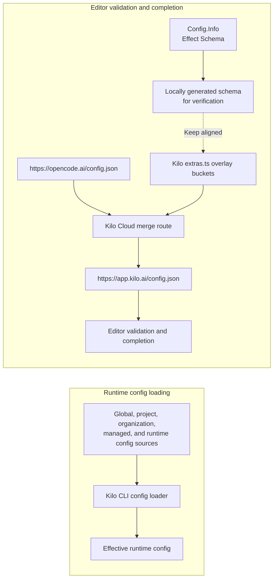

# CLI Config Schema

Kilo config has two related but separate paths:

- Kilo CLI runtime loads and merges config locally.
- Cloud-served JSON Schema gives editors validation and completion for `kilo.json` and `kilo.jsonc`.

JSON Schema does not load, apply, or override runtime config.

```jsonc
{
  "$schema": "https://app.kilo.ai/config.json"
}
```

## Two separate paths



Changing runtime config precedence affects first path. Adding or changing config key affects both paths because editor schema must describe keys CLI accepts. See [CLI Runtime config precedence](/docs/contributing/architecture/cli-runtime#config-precedence) for runtime merge order.

## Source of truth

Canonical CLI config source is Effect Schema `Config.Info` in `packages/opencode/src/config/config.ts` in [`Kilo-Org/kilocode`](https://github.com/Kilo-Org/kilocode). CLI derives `.zod` compatibility surface from Effect Schema for plugin and SDK consumers. Do not maintain separate handwritten Zod definition for Kilo config fields.

## Cloud schema endpoint

Static source review of [`Kilo-Org/cloud`](https://github.com/Kilo-Org/cloud) shows this route behavior:

1. Editor fetches `https://app.kilo.ai/config.json` because config file references `$schema`.
2. Cloud route `apps/web/src/app/config.json/route.ts` fetches `https://opencode.ai/config.json`.
3. Route runs `merge()` and returns upstream schema with Kilo additions and overrides.
4. `merge()` overlays buckets from `apps/web/src/app/config.json/extras.ts`.

Cloud source defines 1-hour upstream revalidation and edge-cache headers. This describes checked-in route behavior, not live deployment or cache state.

## Overlay buckets

Reviewed cloud source overlays:

| Bucket | Purpose |
|---|---|
| `top` | Top-level Kilo keys and overrides |
| `agents` | Kilo primary agents under `agent` |
| `experimental` | Kilo experimental keys under `experimental` |

Nested CLI fields outside these buckets need dedicated overlay bucket and matching `merge()` logic.

## Failure mode

If cloud overlay misses valid CLI field, CLI can accept config while editor reports `unknown property`. Opposite drift is also possible: cloud schema can advertise field that runtime no longer accepts.

Treat schema synchronization as cross-repository contract. Tests should detect both missing valid fields and stale overlay entries. Keep branch-specific drift findings in tracked issues or test output, not this architecture page.

## Adding or changing Kilo-only config key

1. Add or update Effect Schema field with `kilocode_change` marker in `packages/opencode/src/config/config.ts`.
2. Generate JSON Schema shape:

```sh
bun --bun packages/opencode/script/schema.ts /tmp/kilo.json
jq '.properties.<new_key>' /tmp/kilo.json
```

3. Update matching bucket in `apps/web/src/app/config.json/extras.ts` in [cloud repo](https://github.com/Kilo-Org/cloud).
4. Extend `merge()` in `apps/web/src/app/config.json/route.ts` when new nested bucket is required.
5. Add assertion in `apps/web/src/tests/cli-config-schema.test.ts`.
6. Audit stale overlay entries as well as missing additions.


CLI schema source lives in `Kilo-Org/kilocode`. Public editor schema overlay lives in `Kilo-Org/cloud`. Config-key change is incomplete until both repositories agree.


## Source map

Repository column identifies source root for each relative path.

| Repository | Source path | Role |
|---|---|---|
| `Kilo-Org/kilocode` | `packages/opencode/src/config/config.ts` | Canonical Effect Schema and derived `.zod` surface |
| `Kilo-Org/cloud` | `apps/web/src/app/config.json/route.ts` | Cloud overlay route |
| `Kilo-Org/cloud` | `apps/web/src/app/config.json/extras.ts` | Kilo overlay buckets |
| `Kilo-Org/cloud` | `apps/web/src/tests/cli-config-schema.test.ts` | Cloud schema assertions |

## Related pages

- [CLI Runtime](/docs/contributing/architecture/cli-runtime#config-precedence) - runtime config loading and precedence
- [Development Patterns](/docs/contributing/architecture/development-patterns) - shared-file markers, Kilo-owned boundaries, and cross-repository contributor workflow
