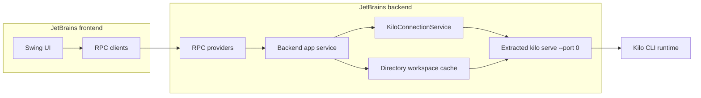

# JetBrains Plugin Architecture

The JetBrains plugin (`packages/kilo-jetbrains/`) is a split-mode Swing client of [Kilo CLI runtime](/docs/contributing/architecture/cli-runtime). Frontend module renders IDE UI. Backend module owns project-local logic and one bundled `kilo serve` server. Shared module defines cross-process RPC contracts and serializable payloads.


This page describes repository-defined plugin architecture and development checks. It does not claim Marketplace rollout state or remote-host deployment configuration.


## Split-mode modules

[CLI Runtime](/docs/contributing/architecture/cli-runtime) defines shared local-server authentication, directory routing, provider routing, persistence, and SSE contracts. This page starts at JetBrains client boundary.

| Module | Runs where | Responsibility |
|---|---|---|
| `shared` | Frontend and backend | `@Rpc` interfaces, `RemoteApi<Unit>` contracts, serializable DTOs, shared logging helpers |
| `frontend` | JetBrains frontend | Swing UI, typing assistance, latency-sensitive client work, backend RPC calls |
| `backend` | JetBrains backend | Project model, analysis, CLI extraction and process lifecycle, HTTP/SSE, workspace state, RPC implementations |

In monolithic IDE mode, all modules load in one process and RPC calls remain in-process suspend calls. In remote development, frontend and backend can run in separate processes. Payloads crossing boundary use `kotlinx.serialization`.



## Frontend-to-backend RPC

Shared RPC surfaces separate app, workspace, session, and migration behavior.

| Contract | Scope | Examples |
|---|---|---|
| `KiloAppRpcApi` | Application | Connect, state flow, health, retry, restart, reinstall, model state, profile, login, telemetry |
| `KiloWorkspaceRpcApi` | Directory | Resolve real backend project directory, workspace state flow, reload, file lookup, open file |
| `KiloSessionRpcApi` | Session and directory | Create/list sessions, prompt, stream events, permission and question replies, config update |
| `KiloMigrationRpcApi` | Legacy migration | Detect, run, and observe migration state |

Frontend calls RPC from coroutines, not Event Dispatch Thread (EDT). Swing creation, mutation, and access remain on EDT. Long-lived RPC calls and flows should use JetBrains durable patterns so UI can survive reconnect and backend restart.

## Bundled CLI lifecycle

Backend extracts CLI resource from plugin JAR into IntelliJ system path:

```text
<PathManager.getSystemPath()>/kilo/bin/kilo
<PathManager.getSystemPath()>/kilo/bin/kilo.exe   # Windows
```

It chooses platform resource by OS and CPU architecture, reuses extracted binary when resource size matches, and can force re-extraction during reinstall flow. This editor-owned child is separate from detached local daemon managed by `kilo daemon`.

| Area | Behavior |
|---|---|
| Spawn | Runs extracted binary as `kilo serve --port 0` |
| Port | CLI server prefers `4096`, then asks OS for free port; backend reads listening line from stdout |
| Authentication | Generates random 32-byte hex password and passes `KILO_SERVER_PASSWORD`; username defaults to `kilo` |
| Environment | Sets JetBrains client/platform metadata, question tool enablement, telemetry level, Claude Code disable flag, and default edit/bash ask permissions unless overridden |
| Ownership | Backend app service owns CLI manager and connection lifecycle |
| Shutdown | Kills process descendants, then process; uses forced termination after timeout when needed |

## Generated Kotlin client

JetBrains backend does not consume checked-in JavaScript SDK. Gradle owns build-local client flow:

1. Generate CLI OpenAPI into backend build directory.
2. Normalize spec for Kotlin generation.
3. Run OpenAPI Kotlin generator with `jvm-okhttp4` library.
4. Compile generated Kotlin source with backend.

Generated `DefaultApi` handles typed CLI endpoint calls. Selected paths use raw HTTP when generated client shape is unsuitable for specific request behavior.

## Connection and recovery

Backend connection service uses bundled OkHttp clients and `/global/event` SSE.

| Signal or path | Behavior |
|---|---|
| API client | No call/read timeout for generated API and SSE |
| App-load client | Bounded timeout for startup requests |
| Health client | 3 second timeout for `/global/health` polling |
| SSE | OkHttp EventSource connects to `/global/event` |
| Heartbeat | Server emits every 10 seconds; watcher reconnects after 15 seconds without event |
| Health poll | Runs every 10 seconds and forces reconnect on failure |
| SSE failure | Waits 250 ms, reconnects stream if process lives, or delegates full backend reconnect |
| Process monitor | On child exit, clears process state, reports error, and schedules reconnect |

## Workspace routing

Backend workspace manager caches workspace clients by directory path. Root project and worktree are same routing shape: worktree is alternate directory key. First lookup creates workspace object and starts load; disconnect clears cache.

This mirrors CLI `InstanceStore`: directory remains isolation key while one editor-owned `kilo serve` process serves multiple workspace contexts.

## Remote development constraints

Split mode changes path and UI assumptions:

| Constraint | Rule |
|---|---|
| Project path | Frontend base path can be synthetic; resolve real project directory through backend RPC before CLI calls |
| UI toolkit | Use Swing and IntelliJ platform components; do not use JCEF because it does not work for remote split-mode host arrangement |
| RPC traffic | Debounce UI events, batch requests, cache results, and page large payloads |
| First paint | Render empty state promptly and fill backend data progressively |
| Blocking I/O | Keep in backend/background context; switch to `Dispatchers.IO` inside callee |

## Development checks

JetBrains Kotlin toolchain is Java 21. Check `java -version` before Gradle verification.

| Check | Command from `packages/kilo-jetbrains/` |
|---|---|
| Typecheck | `./gradlew typecheck` |
| Tests | `./gradlew test` |
| Full plugin build | `bun run build` |
| Gradle plugin assembly with prepared CLI binaries | `./gradlew buildPlugin` |
| Sandbox IDE | `./gradlew runIde` |
| Split backend sandbox | `./gradlew runIdeBackend` |
| Split-mode run configs | `./gradlew generateSplitModeRunConfigurations` |

Run `Plugin DevKit | Code | Frontend and Backend API Usage` inspection when moving code across split boundary.

## Source map

Paths below are relative to [`Kilo-Org/kilocode`](https://github.com/Kilo-Org/kilocode).

| Concern | Source path |
|---|---|
| Split modules | `packages/kilo-jetbrains/settings.gradle.kts` and module XML descriptors |
| Contributor constraints | `packages/kilo-jetbrains/AGENTS.md` |
| CLI lifecycle | `packages/kilo-jetbrains/backend/src/main/kotlin/ai/kilocode/backend/cli/KiloBackendCliManager.kt` |
| Connection recovery | `packages/kilo-jetbrains/backend/src/main/kotlin/ai/kilocode/backend/app/KiloBackendConnectionService.kt` |
| Workspace cache | `packages/kilo-jetbrains/backend/src/main/kotlin/ai/kilocode/backend/workspace/KiloBackendWorkspaceManager.kt` |
| Kotlin client generation | `packages/kilo-jetbrains/backend/build.gradle.kts` |
| RPC contracts | `packages/kilo-jetbrains/shared/src/main/kotlin/ai/kilocode/rpc/` |

## Related pages

- [Architecture Overview](/docs/contributing/architecture) - local and hosted execution map
- [CLI Runtime](/docs/contributing/architecture/cli-runtime) - shared local-server, routing, persistence, and SSE behavior
- [VS Code Extension](/docs/contributing/architecture/vscode-extension) - corresponding editor-client architecture for VS Code
- [Development Patterns](/docs/contributing/architecture/development-patterns) - choose code-ownership seam and validation workflow before editing plugin contracts
